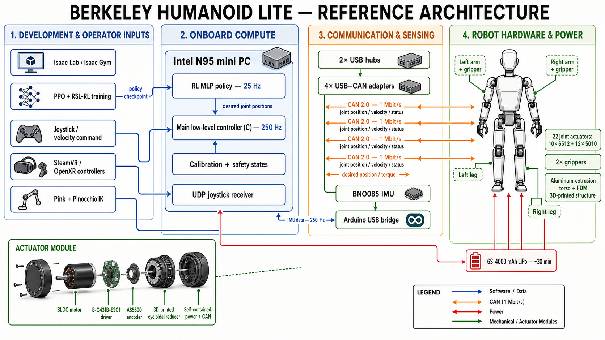

# Berkeley Humanoid Lite reference architecture

This diagram describes the published Berkeley Humanoid Lite reference design.
It is not yet a Dexter hardware design or wiring diagram.

## Hardware modules

| Module | Published configuration | Function |
|---|---|---|
| Robot structure | 0.8 m, 16 kg; aluminum-extrusion torso and FDM 3D-printed parts | Modular mechanical frame |
| Joint actuators | 10 x 6512 and 12 x 5010 actuators; two grippers | 22 powered robot joints plus end effectors |
| Actuator electronics | BLDC motor, B-G431B-ESC1 driver and AS5600 encoder | Closed-loop joint position, velocity and torque control |
| Joint reduction | 3D-printed cycloidal gearbox | Torque multiplication in a printable modular package |
| Onboard computer | Intel N95 mini PC | Low-level control, policy inference and robot utilities |
| Limb networks | Four USB-CAN adapters and four CAN 2.0 buses at 1 Mbit/s | Separate communication links for the four limbs |
| USB expansion | Two USB hubs | Connects CAN adapters, IMU bridge and peripherals |
| IMU | BNO085 through an Arduino USB bridge | Torso orientation and angular-velocity feedback at 250 Hz |
| Power | 6S 4000 mAh LiPo | Approximately 30 minutes of onboard operation |
| Operator input | Joystick and SteamVR/OpenXR controllers | Velocity commands, mode changes and teleoperation targets |

## Software modules and control flow

| Module | Role |
|---|---|
| `source/berkeley_humanoid_lite` | Isaac Lab environments and task definitions |
| `source/berkeley_humanoid_lite_assets` | URDF, MJCF and USD robot descriptions plus Onshape export |
| `source/berkeley_humanoid_lite_lowlevel` | Real-robot low-level control, CAN, IMU, calibration and deployment |
| `scripts/rsl_rl` | Reinforcement-learning training workflow |
| `scripts/sim2sim` | Policy validation in a second simulator |
| `scripts/sim2real` | Real-robot deployment/visualization workflow |
| `scripts/teleop` | Connection checks, idle mode, gripper tests and teleoperation |
| Main C controller | Runs the joint and IMU loop at 250 Hz |
| RL MLP policy | Runs onboard at 25 Hz and produces desired joint positions |
| Pink + Pinocchio | Converts teleoperation end-effector targets into joint targets |

## Dexter integration implications

- Berkeley uses four 1 Mbit/s CAN buses. The current Dexter STM32L552 firmware
  uses 500 kbit/s, so the bitrate and network topology are not directly
  compatible yet.
- Berkeley joints are self-contained closed-loop BLDC actuator modules. The
  current Dexter three-stepper controller can remain useful for linear or
  auxiliary mechanisms, but it is not a drop-in replacement for those joints.
- A Dexter design following this architecture would normally use the STM32MP2
  for policy, kinematics and supervision, with one or more real-time MCU nodes
  responsible for deterministic CAN, actuator commands and safety handling.

## Reference sources

- [Berkeley Humanoid Lite repository](https://github.com/HybridRobotics/Berkeley-Humanoid-Lite)
- [Berkeley Humanoid Lite low-level controller](https://github.com/HybridRobotics/Berkeley-Humanoid-Lite-Lowlevel)
- [RSS 2025 paper](https://arxiv.org/html/2504.17249v1)

