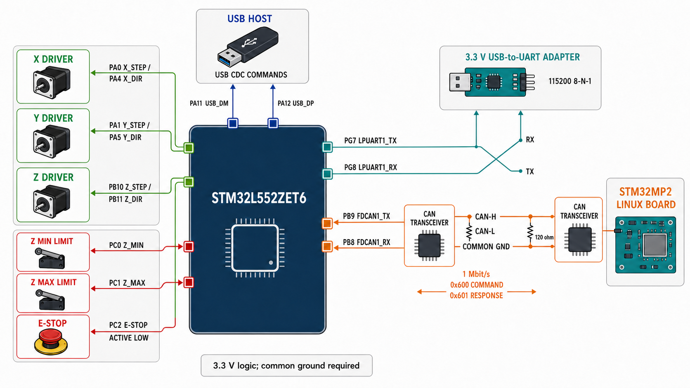

# Connection overview

## Interface wiring

| Interface | STM32L552 connection | External connection | Notes |
|---|---|---|---|
| X stepper | PA0 STEP, PA4 DIR | X motor driver logic inputs | 3.3 V logic |
| Y stepper | PA1 STEP, PA5 DIR | Y motor driver logic inputs | 3.3 V logic |
| Z stepper | PB10 STEP, PB11 DIR | Z motor driver logic inputs | 3.3 V logic |
| Z minimum limit | PC0 | Switch to the configured active level | Internal pull-up |
| Z maximum limit | PC1 | Switch to the configured active level | Internal pull-up |
| Emergency stop | PC2 | Normally-open button to GND | Active-low, internal pull-up |
| USB CDC | PA11 DM, PA12 DP | USB host | Command interface |
| LPUART1 | PG7 TX, PG8 RX | Adapter RX, adapter TX | Cross TX/RX; 115200 8-N-1 |
| FDCAN1 | PB9 TX, PB8 RX | L5-side CAN transceiver | Never connect MCU pins directly to CAN-H/CAN-L |
| CAN bus | Transceiver CAN-H/CAN-L | MP2-side CAN transceiver | 1 Mbit/s, common ground, 120 ohm at both ends |

The CAN command defaults are standard ID `0x600` for L5 receive and `0x601`
for L5 responses. Query with `CANID?` and change them at runtime with
`CANID <RX> <TX>`.

> The image is an interface overview, not a substitute for the MCU, driver, or
> transceiver datasheets. Confirm connector pin numbering, motor-driver input
> ratings, current limits, grounding, and E-stop hardware before energizing.
