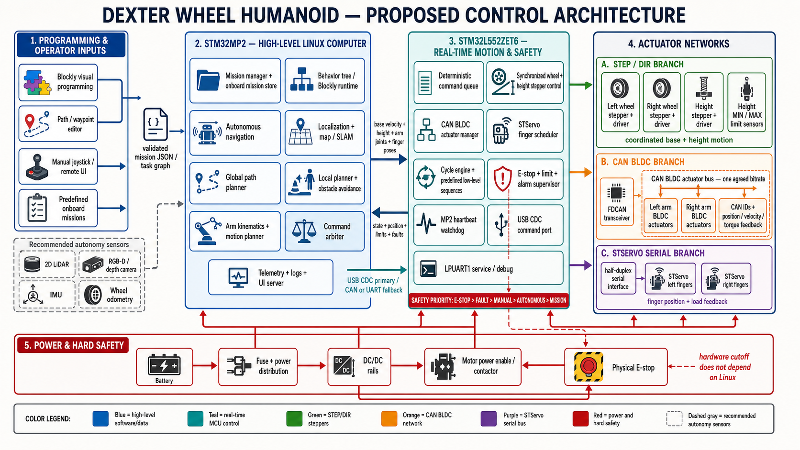

# Dexter proposed control architecture

This proposal interprets `STM32M2` as the STM32MP2 Linux processor previously
selected for the project.

## Responsibility split

| Controller | Responsibilities |
|---|---|
| STM32MP2 | Blockly runtime, saved missions, autonomous navigation, map and localization, path planning, obstacle avoidance, arm planning, command arbitration, UI, logs and telemetry |
| STM32L552ZET6 | Deterministic actuator scheduling, synchronized wheel and height motion, CAN BLDC management, STServo scheduling, limit handling, E-stop, alarms and MP2 heartbeat supervision |

Linux is permitted to request motion but not to bypass STM32L552 safety. A lost
MP2 heartbeat, physical E-stop, limit alarm or actuator fault must stop or
de-energize motion without waiting for Linux.

## Actuator networks

| Network | Connected hardware | Controller behavior |
|---|---|---|
| STEP/DIR | Left wheel stepper, right wheel stepper and height stepper | Coordinated wheel motion and independent/synchronized height motion |
| FDCAN | Left and right arm CAN BLDC actuators | Unique node IDs, cyclic command/feedback, fault and timeout monitoring |
| STServo serial | Left and right finger servos | Position commands, load feedback and grouped hand poses |
| GPIO safety | Height minimum/maximum limits, physical E-stop and motor enable | Immediate local safety response |

The entire CAN actuator network must use one agreed bitrate. If the BLDC
actuators require 1 Mbit/s, the current 500 kbit/s STM32L552 configuration must
be changed or a separate CAN controller/gateway must be added.

## Autonomous and programmable operation

All command sources converge at the STM32MP2 command arbiter:

1. Blockly blocks or a path editor compile into a versioned mission JSON/task
   graph.
2. The mission validator checks schema, joint/height limits, speed limits,
   required map and permitted operations before saving it onboard.
3. The mission manager loads predefined or user-created missions.
4. Navigation and arm planners convert mission actions into bounded motion
   targets.
5. STM32L552 accepts only valid low-level commands and reports position,
   limits, faults and completion state.

Recommended mission actions include `navigate`, `rotate`, `set_height`,
`move_arm`, `set_fingers`, `wait`, `if`, `repeat`, `call_mission` and
`safe_stop`. Each mission should include a format version, unique ID, checksum,
required robot configuration and maximum execution time.

## Command priority

The proposed arbitration order is:

`E-stop > hardware/actuator fault > manual control > autonomous recovery > active mission`

Manual takeover should pause the mission rather than silently mixing manual and
autonomous targets. Resuming should require revalidation of the robot state and
remaining path.

## Recommended autonomy sensors

The base architecture can run predefined open-loop sequences without perception.
Reliable autonomous navigation additionally needs:

- 2D LiDAR or an equivalent range sensor;
- RGB-D/depth camera for near-field obstacles and manipulation;
- IMU;
- wheel encoders or other wheel odometry feedback.

These sensors connect to STM32MP2. Safety-critical switches and the E-stop stay
directly connected to STM32L552 and the hardware motor-power cutoff.

